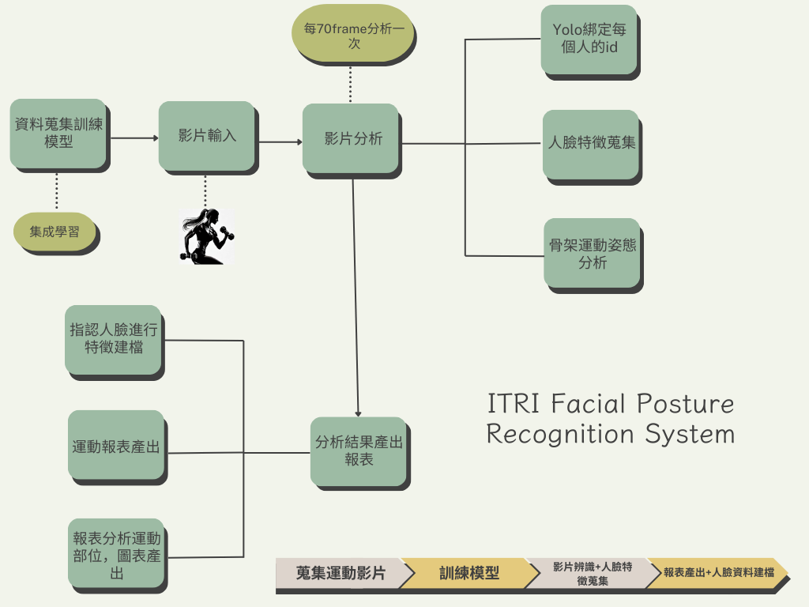

# 人臉辨識+姿態辨識專案

## 流程圖



## 專案結構
```markdown
├─ .ipynb_checkpoints             # Jupyter Notebook 檢查點檔案
├─ IDdata                         # 身份數據資料夾
│  └─ .ipynb_checkpoints          # IDdata 資料夾中的檢查點檔案
├─ Model                          # 模型相關檔案資料夾
│  └─ .ipynb_checkpoints          # Model 資料夾中的檢查點檔案
├─ PostureRecognition             # 姿勢識別系統資料夾
│  ├─ .ipynb_checkpoints          # PostureRecognition 資料夾中的檢查點檔案
│  ├─ action                      # 運動動作影片資料夾
│  │  └─ 運動動作影片            # 存放運動動作影片
│  ├─ action_npy                  # 運動動作轉換為 npy 檔案資料夾
│  │  └─ 運動動作轉npy檔案       # 存放轉換後的 npy 檔案
│  ├─ Model                       # 存放模型檔案
│  ├─ train                       # 訓練資料和相關檔案資料夾
│  │  └─ 運動動作切片            # 存放運動動作切片資料
│  └─ __pycache__                 # 存放 Python 編譯後的快取檔案
├─ __pycache__                    # 主目錄中的 Python 編譯後快取檔案
└─ 動作人臉測試影片                # 動作人臉測試影片資料夾
    └─ .ipynb_checkpoints          # 動作人臉測試影片資料夾中的檢查點檔案
```

## 功能細節說明

### 1. 資料蒐集與訓練模型
- **資料來源**：包括網路數據集、自行拍攝影片等。
- **資料轉換訓練格式**：使用Mediapipe將人體影片轉換成骨架資訊，並依照時間步長將影片分割成相同長度的片段，進行模型訓練。
- **資料增強**：將骨架水平翻轉，以增強模型的泛化能力。
- **訓練模型**：
  - 使用集成學習方法（LSTM + GRU + TCN）進行骨架姿態辨識。

### 2. 影片輸入
- **影片格式**：支援MP4格式。
- **影片預處理**：使用YOLO和Mediapipe將影片轉換成骨架資訊，實現多人同時辨識。

### 3. 影片分析
- **分析頻率**：每70幀分析一次。
- **使用工具**：使用YOLO綁定每個不同人的ID，進行骨架資訊和人臉資訊的蒐集及分析。
- **數據提取**：提取每幀中的關鍵點和特徵。

### 4. Yolo綁定每個人的id
- **ID分配**：使用YOLO將不同人框起來並分配一個獨立的ID編號，無需進行模型訓練。
- **ID管理**：建立數據庫管理每個人的ID，確保準確綁定。

### 5. 人臉特徵蒐集
- **特徵提取**：使用人臉識別模型（如FaceNet）提取人臉特徵。
- **數據存儲**：將提取的特徵存儲於資料庫中，便於後續查詢。

### 6. 骨架運動姿態分析
- **姿態估計**：使用Mediapipe進行骨架姿態估計。
- **數據分析**：對骨架數據進行分析，評估運動姿態的準確性。

### 7. 指認人臉進行特徵建檔
- **特徵匹配**：使用特徵點匹配技術進行人臉識別，建立個人特徵檔案。
- **資料管理**：建立特徵資料庫，確保數據安全和高效查詢。

### 8. 運動報表產出
- **報表內容**：包括運動次數、持續時間、姿態評估等。
- **格式**：生成圖表、數據可視化報表。
- **報表生成**：自動化生成報表，提供運動進度追蹤。

### 9. 報表分析運動部位，固表產出
- **分析方法**：使用數據分析工具對運動部位進行分析，提取關鍵指標。
- **報表生成**：根據分析結果生成固定格式報表，便於對比分析。

### 10. 分析結果產出報表
- **展示方式**：使用圖表、數據可視化工具展示分析結果。
- **決策支持**：根據分析結果進行運動計劃調整和效果評估。


[PostureRecognition 訓練模型流程說明](https://github.com/orange1314/ITRI_Facial_Posture_Recognition_System/blob/main/PostureRecognition/PostureRecognition.md)

[action_recognition_main.py 推理流程說明](https://github.com/orange1314/ITRI_Facial_Posture_Recognition_System/blob/main/action_recognition_main.md)

[Data_Processing.ipynb 資料處理流程](https://github.com/orange1314/ITRI_Facial_Posture_Recognition_System/blob/main/Data_Processing.md)


```python

```
