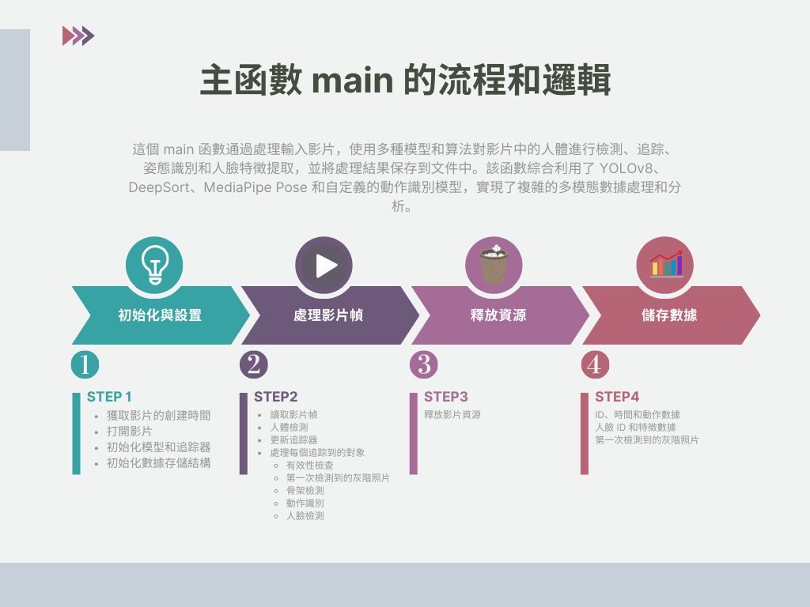

# action_recognition_main

### 函數功能說明

1. **`get_video_metadata` 函數**
    - **功能**：獲取視頻文件的元數據，特別是創建時間。
    - **參數**：
        - `video_path`: 視頻文件的路徑。
    - **返回**：創建時間的 ISO 格式字符串。

2. **`main` 函數**
    - **功能**：處理視頻文件，檢測人體姿態和人臉特徵，並保存結果。
    - **參數**：
        - `video_path`: 視頻文件的路徑。
    - **主要步驟**：
        - 獲取視頻創建時間並初始化視頻捕獲。
        - 初始化人臉檢測、追踪器和姿態檢測模型。
        - 加載動作識別模型和標籤編碼器。
        - 遍歷每幀視頻，使用 YOLO 進行人體檢測，DeepSort 進行追踪。
        - 對每個追踪對象進行姿態檢測和動作識別。
        - 對每個追踪對象進行人臉特徵提取。
        - 儲存檢測結果，包括動作數據、人臉特徵和第一次檢測到的灰階照片。

3. **`parse_arguments` 函數**
    - **功能**：解析命令行參數，獲取視頻文件的路徑。
    - **返回**：解析後的參數對象，包含視頻文件的路徑。


### 主函數 `main` 的流程和邏輯

1. **初始化與設置**
    - **獲取影片的創建時間**
        - 使用 `get_video_metadata` 函數獲取影片的創建時間。
        - 如果無法獲取創建時間，則使用當前時間作為開始時間。
    - **打開影片**
        - 使用 OpenCV 打開影片文件並獲取影片的基本信息（寬度、高度、幀率和總幀數）。
        - 檢查影片是否成功打開，否則打印錯誤信息並退出程序。
    - **初始化模型和追踪器**
        - **人臉檢測和編碼模型**：使用 `FaceAnalysis` 初始化人臉檢測模型。
        - **DeepSort 追踪器**：初始化 `DeepSort` 追踪器，用於對象追踪。
        - **MediaPipe Pose 模型**：初始化 `MediaPipe Pose` 模型，用於骨架關鍵點檢測。
        - **計算設備**：檢查是否有可用的 GPU，如果有，則使用 GPU。
        - **姿態識別模型**：加載姿態標籤編碼器和動作識別模型，包括 LSTM、GRU 和 TCN 模型，將模型移動到設置的計算設備上並設置為評估模式。
    - **初始化數據存儲結構**
        - 使用 `defaultdict` 和 `deque` 儲存每個 ID 的骨架數據序列。
        - 初始化列表用於存儲骨架數據、人臉 ID 和特徵、以及每個 ID 的第一張灰階照片。
        - **初始化 YOLOv8 模型**：使用 YOLOv8 進行人體檢測。

2. **處理影片幀**
    - **進度條**：使用 `rich.progress` 初始化進度條。
    - **讀取影片幀**：迭代讀取影片的每一幀。
    - **人體檢測**：使用 YOLOv8 模型進行人體檢測，獲取每個檢測到的人體邊界框和置信度。
    - **更新追踪器**：使用 DeepSort 追踪檢測到的對象，獲取追踪到的對象信息。
    - **處理每個追踪到的對象**
        - **有效性檢查**：檢查邊界框是否有效，確保圖像非空。
        - **第一次檢測到的灰階照片**：保存每個追踪對象的第一次檢測到的灰階照片。
        - **骨架檢測**：使用 MediaPipe Pose 檢測骨架關鍵點。
        - **動作識別**：
            - 累積骨架數據，當累積滿 `time_steps` 個骨架時，進行動作識別。
            - 以髖部為中心標準化骨架數據，並將其輸入動作識別模型。
            - 獲取識別結果和置信度，如果置信度低於 0.9，則顯示 "unknown"。
            - 計算當前幀的時間，並保存識別結果。
        - **人臉檢測**：使用人臉檢測模型檢測人臉，並提取人臉特徵。
    - **更新進度條**：更新進度條顯示處理進度。

3. **釋放資源**
    - 釋放影片資源。

4. **儲存數據**
    - **ID、時間和動作數據**：將骨架數據保存到文件中。
    - **人臉 ID 和特徵數據**：將人臉特徵保存到文件中。
    - **第一次檢測到的灰階照片**：將灰階照片保存到文件中。

5. **結束**
    - 打印 "Processing complete." 提示處理完成。


```python

```
